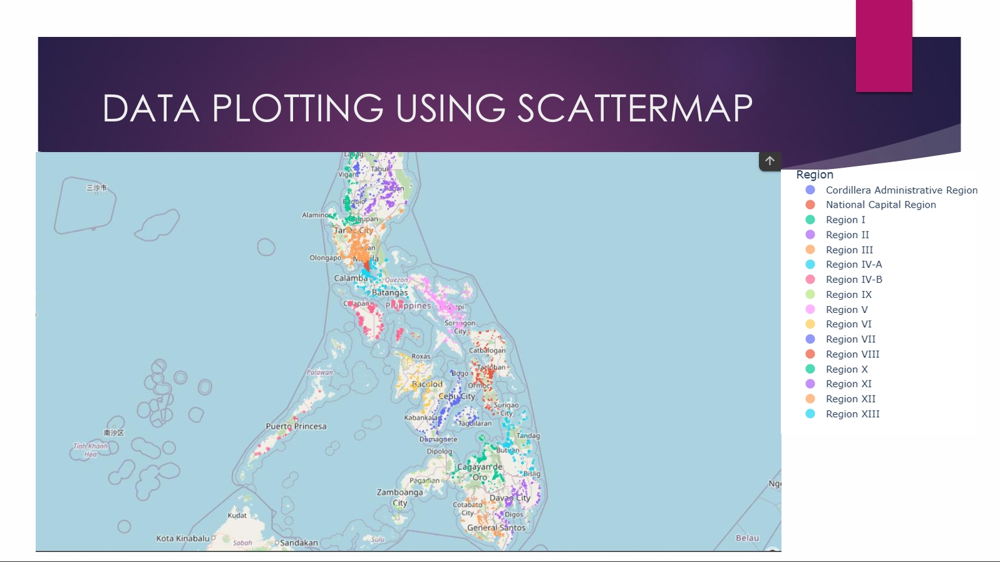
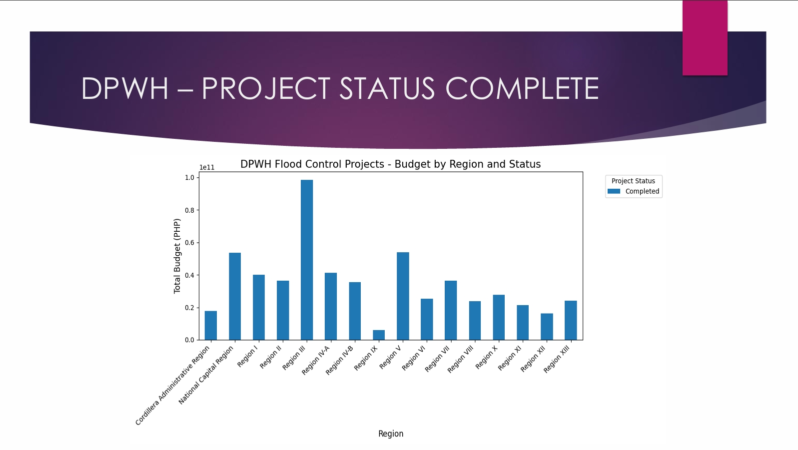
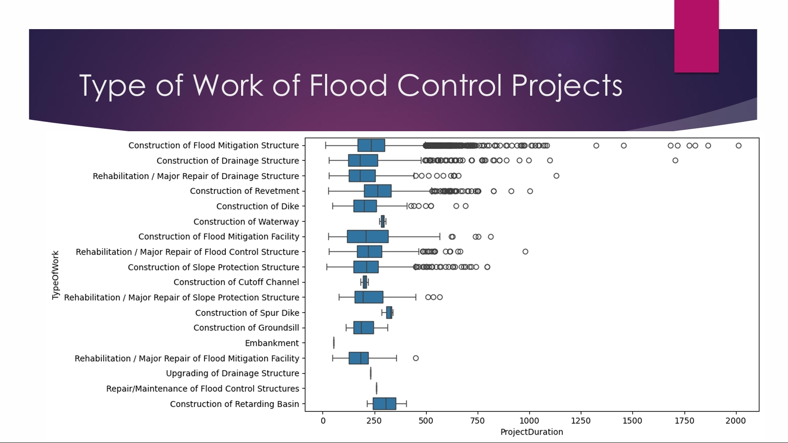
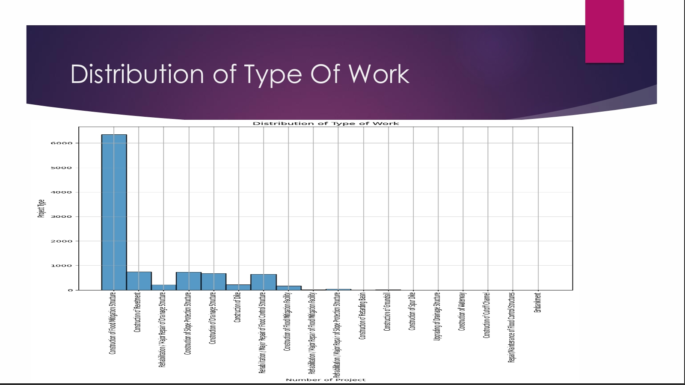
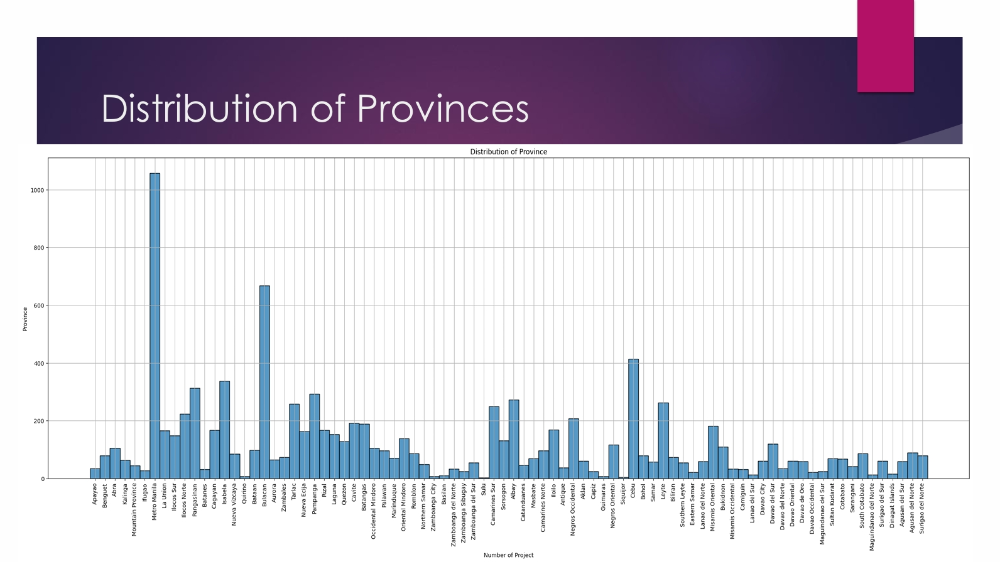
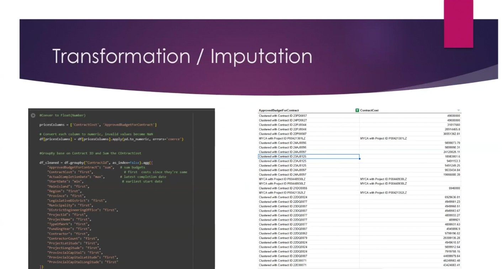
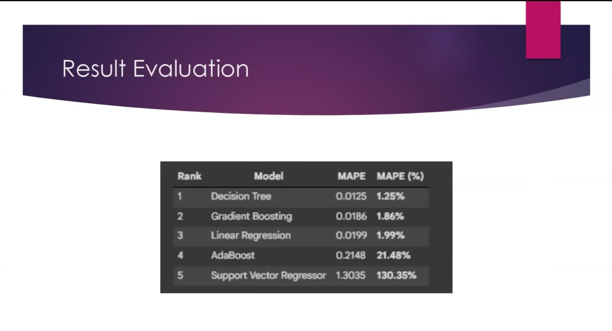

# DPWH-Flood-Control-Budget-and-Analysis
In large-scale infrastructure projects like those managed by the Department of Public Works and Highways (DPWH), delays and budget overruns are critical challenges. This project leverages Supervised Machine Learning to analyze historical project data, specifically focusing on flood control initiatives.

# Project Name

## 📄 Documentation

